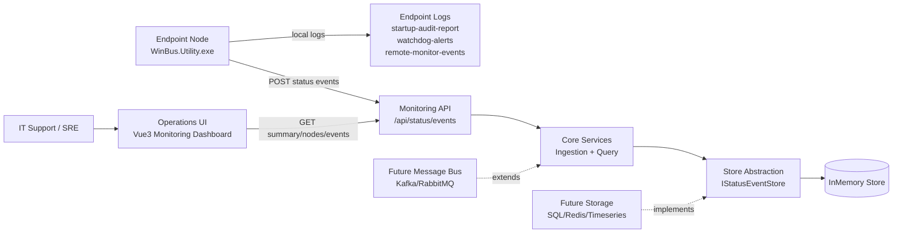

# WinBus End-to-End Architecture

## Overview

The platform is designed as a modular system with clear separation between endpoint optimization, monitoring ingestion, and remote visualization.

- Endpoint utility (`WinBus.Utility.exe`) performs controlled tuning modules.
- Monitoring API (`WinBus.Monitoring.Api`) ingests and serves fleet status.
- Monitoring UI (`monitoring-ui`) provides real-time operations dashboards.

## Architecture Diagram

## Current modular boundaries

- `WinBus.Monitoring.Contracts`: DTO contracts shared across API/clients.
- `WinBus.Monitoring.Core`: interfaces and orchestration services.
- `WinBus.Monitoring.Infrastructure`: storage implementation and DI wiring.
- `WinBus.Monitoring.Infrastructure.SqlServer`: persistent SQL Server storage provider.
- `WinBus.Monitoring.Api`: host process and HTTP endpoints.
- `WinBus.Monitoring.QueryApi`: independent read host for dashboard/reporting scale.
- `monitoring-ui`: Vue 3 dashboard consuming API data.

## Future-proof strategy (multi-OS)

### Endpoint agent

Current endpoint utility is Windows-first because it uses Windows APIs (WMI, registry, services).
To support Linux/macOS, keep this split:

1. **Cross-platform agent contract**
   - Define common event schema (`StatusEventDto`) and module lifecycle semantics.
2. **OS-specific executors**
   - `WinBus.Agent.Windows` (existing utility modules)
   - `WinBus.Agent.Linux` (systemd, journald, temp cleanup, startup services)
   - `WinBus.Agent.Mac` (launchd, cache cleanup, startup items)
3. **Common telemetry publisher library**
   - Reuse one publisher package for all agents to avoid divergence.

### Backend services

Backend is already OS-agnostic (.NET web stack).
For large systems:

- Replace in-memory store with SQL/Redis/timeseries backend.
- Split write and read services.
- Add message queue between ingestion and query projection.
- Add authN/authZ (OIDC) and tenant isolation.

### UI layer

Vue 3 dashboard is OS-agnostic and deployable via IIS static hosting, Nginx, or CDN.

## Deployment view

- Small deployment: single API host + in-memory store.
- Medium deployment: API host + SQL store.
- Large deployment: ingestion API + queue + stream processors + query API + UI.

## Reliability and operations recommendations

- Add health probes and uptime checks for API.
- Add retention policies and archival strategy.
- Add alerting rules (high failure rates, heartbeat drop-off).
- Add per-fleet RBAC and audit logs for enterprise scale.
